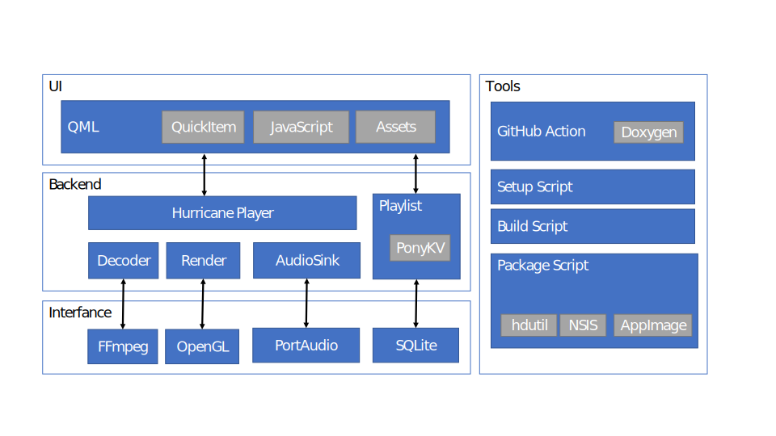
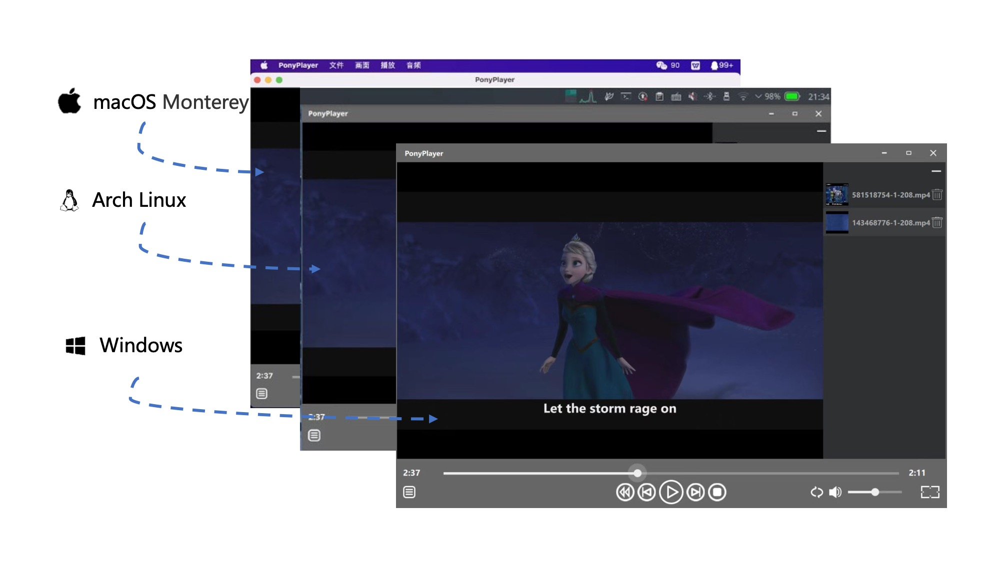
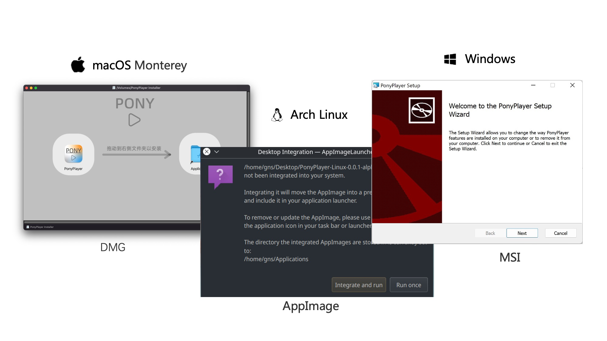

# PonyPlayer

Cross-platform media player.


## Usage

We recommend you use `Clion` as development IDE.

### Requirements

- C++ 17 Compiler (In Windows, mingw64_1120 is required)
- Qt 6.2.4 LTS
- FFmpeg n5.0.1
- python 3.7+
- Additional dependence to package.

### Setup

```bash
python3 scripts/setup.py --qt_path <your qt path> --ffmpeg_path <your ffmpeg path>
```

For example, `qt path` is `/Users/runner/Qt/6.2.4/macos`  and `ffmpeg path` is `/Users/runner/FFmpeg`.

Especially, in Linux, set `ffmpeg path` to `""`.

### Build

```bash
python3 scripts/build.py
```

### Package

You may need additional tool to create installer, see [how to install](https://github.com/SCUT-SE-ProjectMP/PonyPlayer/blob/main/.github/workflows/build.yml).

```bash
python3 scripts/package.py
```

In Windows, we use `NSIS` to create `msi` installer.

In macOS, we use `create-dmg` to create `dmg` installer.

In Linux, we use `appimagetool` to create `AppImage` package.


## Structure



### Project Structure

```
assets      --  external resource files 
config      --  configuration, in particuar, user profiles are also generated here.
docs        --  document
samples     --  video samples for unit tests
thirdparty  --  third party library source code and cmake script
scripts     --  project supporting script to setup, build and package.
src         --  the source code of the project, which can be divided into some modules.
```

### Modules

| Module    | Description                                                  |
| --------- | ------------------------------------------------------------ |
| AudioSink | Audio output module, which integrates into PortAudio. It implements functions related to audio output, such as realizing volume adjustment and speed change. |
| Decoder   | Media decoding module, which integrates into FFmpeg. It implements functions related to decoding stream control, such as seek. |
| Player    | Quickitem module, which integrates into Qt and OpenGL. It registers some Quickitems and exposes them to QML, which are drawn by OpenGL. It also implements functions for playback control. It receives the instructions from the QML and forwards them to the AudioSink and Decoder modules after appropriate processing. |
| Playlist  | Data persistence module, which integrates into Qt SQL. Based on the reflection of Qt MetaObject, it implements configuration-free data persistence. Relevant data will be saved to the local SQLite database. |
| Tests     | Unit tests.                                                  |
| Utils     | Utility, such as wrapper for platform-depended methods and logger. |
| View      | View module, which integrates into QML and implements most of the UI. The UI is written in QML, and simple logic is implemented in JavaScript. |
| Wave      | Wave module. Similar to Player module, it integrates into Qt and OpenGL and registers a Qucikitem which drawn circular music “oscillograph”. |


## Screenshoot





## License

**Copyright (c) 2022 PonyPlayer Team**

Permission is hereby granted, free of charge, to any person obtaining a copy
of this software and associated documentation files (the "Software"), to deal
in the Software without restriction, including without limitation the rights
to use, copy, modify, merge, publish, distribute, sublicense, and/or sell
copies of the Software, and to permit persons to whom the Software is
furnished to do so, subject to the following conditions:

The above copyright notice and this permission notice shall be included in all
copies or substantial portions of the Software.

THE SOFTWARE IS PROVIDED "AS IS", WITHOUT WARRANTY OF ANY KIND, EXPRESS OR
IMPLIED, INCLUDING BUT NOT LIMITED TO THE WARRANTIES OF MERCHANTABILITY,
FITNESS FOR A PARTICULAR PURPOSE AND NONINFRINGEMENT. IN NO EVENT SHALL THE
AUTHORS OR COPYRIGHT HOLDERS BE LIABLE FOR ANY CLAIM, DAMAGES OR OTHER
LIABILITY, WHETHER IN AN ACTION OF CONTRACT, TORT OR OTHERWISE, ARISING FROM,
OUT OF OR IN CONNECTION WITH THE SOFTWARE OR THE USE OR OTHER DEALINGS IN THE
SOFTWARE.

Thrid party license and warrantty are included in `LICENSE.RTF` .


## Documents

https://scut-se-projectmp.github.io/PonyPlayer/

https://github.com/SCUT-SE-ProjectMP/PonyPlayer/tree/main/docs

